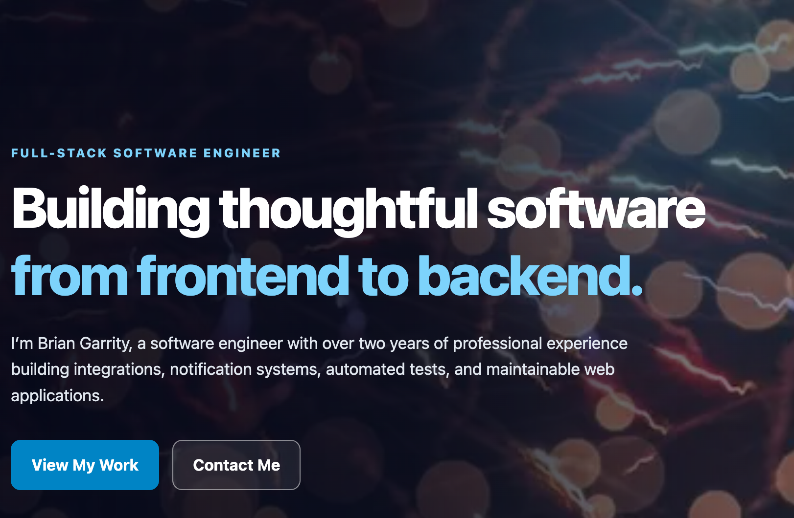
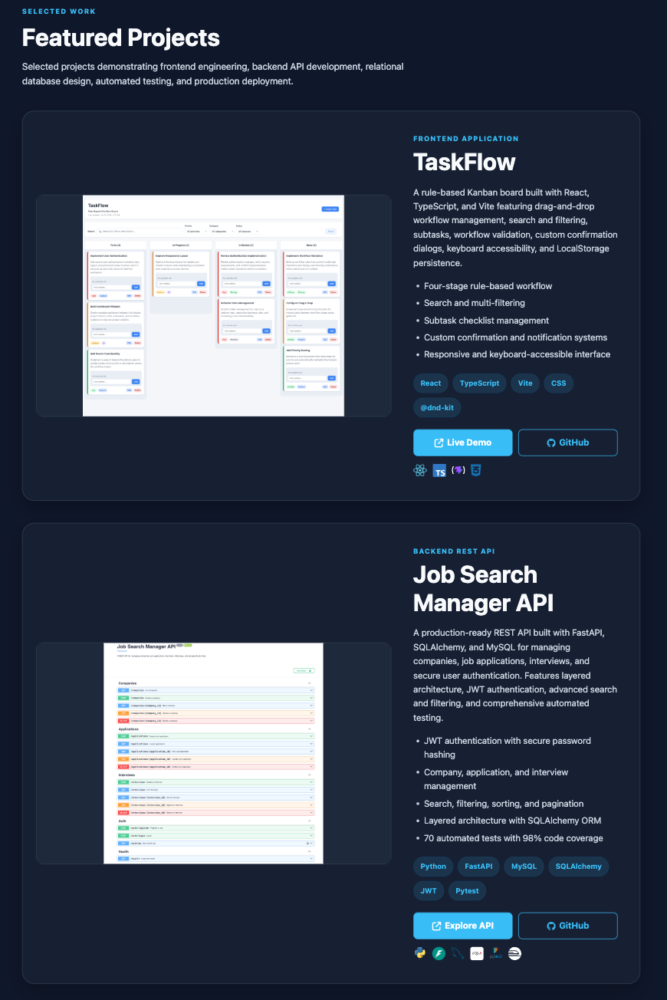
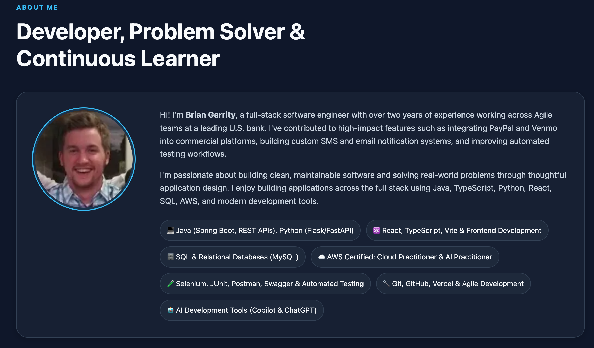

# Brian Garrity Portfolio


A modern, responsive portfolio website showcasing my professional experience, software engineering projects, technical skills, certifications, and contact information.

---

## Live Website

**Portfolio**

https://garrib10.github.io/portfolio-website/

---

## Screenshots

### Home Page



### Featured Projects



### About & Contact



---

## Overview

This portfolio serves as a central hub for my software engineering work and is continuously updated as I complete new projects and expand my technical skills.

Current highlights include:

- Modern responsive portfolio design
- Light/Dark mode with saved theme preference
- Featured project showcase
- Professional experience
- Technical skills overview
- Resume download
- Contact form
- GitHub and LinkedIn integration

---

## Featured Projects

### FinTrack

A production-deployed personal finance application built with Java, Spring Boot, React, TypeScript, and MySQL featuring:

- Secure JWT authentication
- User-scoped financial data
- Transaction management, filtering, sorting, and pagination
- Monthly budget management and spending tracking
- Financial analytics and responsive dashboard visualizations
- Automated backend and frontend testing
- Swagger/OpenAPI documentation
- Vercel, Railway, and MySQL production deployment

### TaskFlow

A rule-based Kanban board built with React, TypeScript, and Vite featuring:

- Drag-and-drop workflow management
- Search and filtering
- Workflow validation
- Keyboard accessibility
- LocalStorage persistence

### Job Search Manager API

A production-ready REST API built with FastAPI, SQLAlchemy, and MySQL featuring:

- JWT authentication
- Company management
- Job application tracking
- Interview scheduling
- Search, filtering, sorting, and pagination
- Automated testing
- Swagger/OpenAPI documentation
- Railway deployment

---

## Tech Stack

### Frontend

- HTML5
- CSS3
- JavaScript
- Bootstrap
- Font Awesome

### Services

- Formspree
- GitHub Pages

---

## Project Structure

```text
portfolio-website/
│
├── assets/
│   ├── icons/
│   ├── images/
│   └── logos/
│
├── resume/
│
├── index.html
├── styles.css
├── scripts.js
└── README.md
```

---

## Running Locally

Clone the repository:

```bash
git clone https://github.com/garrib10/portfolio-website.git
```

Open the project with Live Server or any static web server.

---

## Security Considerations

This site is hosted using GitHub Pages, which has limitations for configuring certain HTTP security headers (such as CSP, HSTS preload, COOP, and X-Frame-Options). If migrated to a platform such as Vercel or Netlify, these headers can be configured through server or deployment settings.

---

## Future Enhancements

- Add FinTrack full-stack application
- Add Selenium Automation Suite
- Expand featured project showcase
- Additional accessibility improvements
- Performance optimizations

---

## License

MIT
